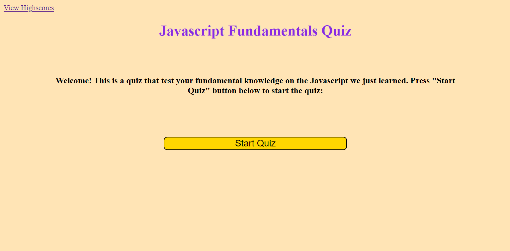
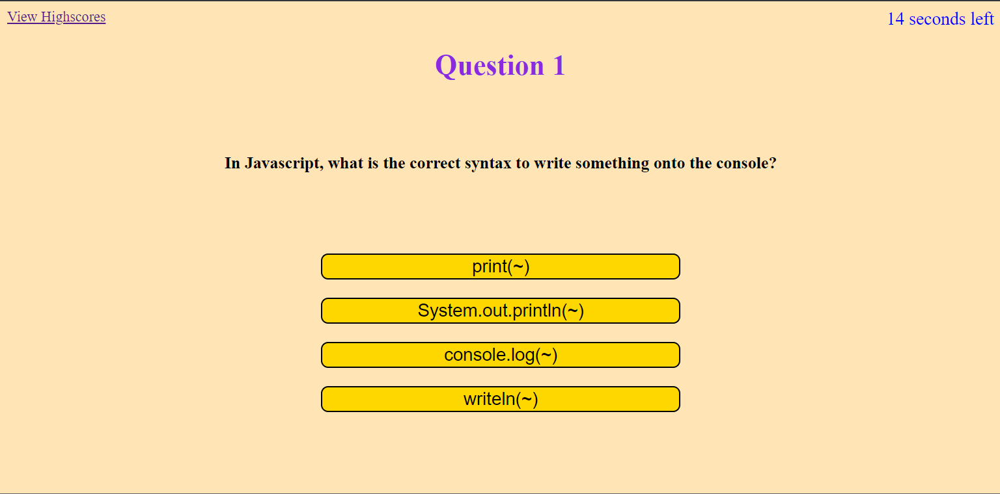
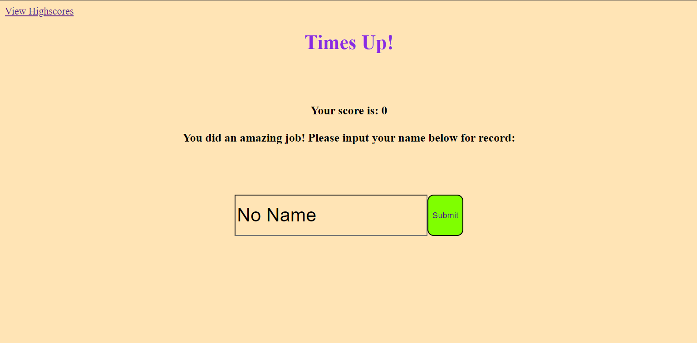
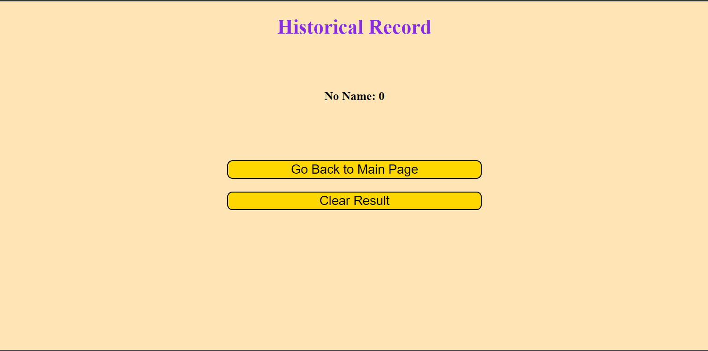

## Description
Welcome! This website will ask you some questions about the Javascript to test your knowledge on the understanding. There are 5 questions, and the time limit is 20 seconds. If you answer a question correctly, you will have extra 5 seconds to ask the question. However, if you answer a question incorrectly, you will lost 5 seconds on your remaining time. If you answer a question correctly, you will get 5 points. If you answer all the question in 20 seconds or your time running out, the quiz will stop and the website will show how much score you got. You can input your name and the website will automatically save the result of each attempt for you to reference later.

This package contain the source code for this website. There are two html files: index.html and highScore.html. The index.html is the main page where you will be taking the quiz with, and highScore.html is the page that display the historical results. The "assets" folder contain all the css and js files which are stored in seperate folders. There is one css file, which styles for both html file. There are two js files, script.js program the index.html, and script2.js program the highScore.html file.
There is also an image folder contains the screen shot of the webpage.

## Screenshot

## Link to Deployed Website
https://wodemingzijiaojianhao.github.io/wohenlihaima/
